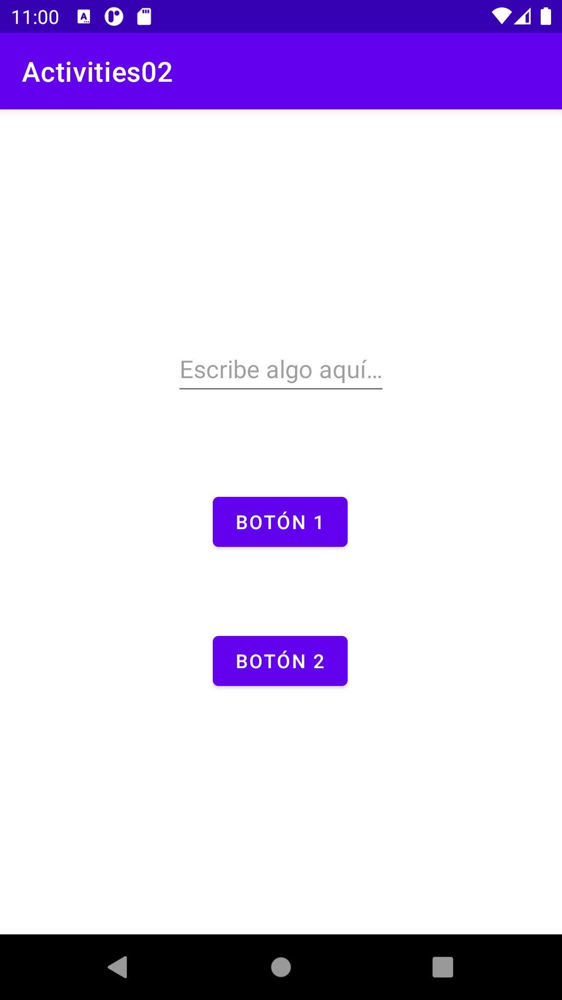

# ejemplos-clase

## Ejercicio 2
- Cree una actividad con un campo de texto y un botón.

- Guarde en una variable la cantidad de veces que se ha hecho clic sobre el botón, de manera que cada que haya un nuevo clic, se imprima en un log de información este número. Pruebe el resultado usando el emulador.

- Cree un nuevo botón para lanzar una nueva actividad. Envíe los datos del campo de texto a la nueva actividad a través del Intent. Programe esta nueva actividad para que cree y muestre los datos recibidos en el Intent con un TextView. Pruebe la aplicación usando el emulador.

- 
